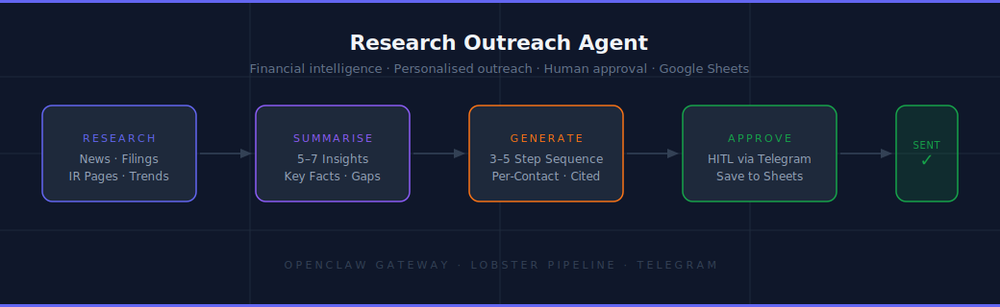
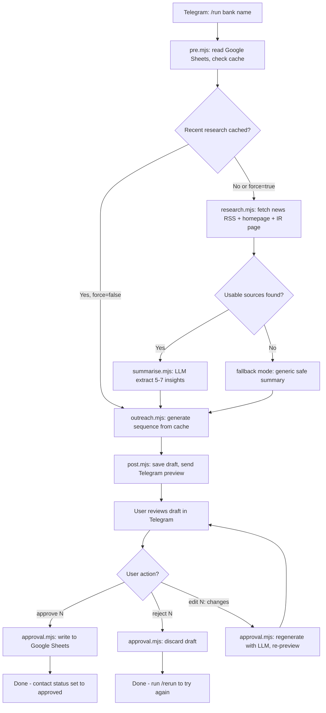

<h1 align="center">OpenClaw Research Outreach Agent</h1>

<p align="center">
  Research financial institutions. Generate personalised outreach sequences. Keep humans in control before saving.
</p>

<p align="center">
  
</p>

<p align="center">
  
</p>

<p align="center">
  
  
  
  
  
  
</p>

An `openclaw` + `ai agent` setup for researching target banks and contacts, generating personalised outreach sequences backed by real insights, and saving approved sequences to Google Sheets only after explicit approval.

## Table of Contents

- [What This Project Does](#what-this-project-does)
- [Key Features](#key-features)
- [Flow Diagram](#flow-diagram)
- [Who This Is For](#who-this-is-for)
- [Folder Overview](#folder-overview)
- [Step-by-Step Install](#step-by-step-install)
- [Google Sheets Schema](#google-sheets-schema)
- [Telegram Commands](#telegram-commands)
- [Pipeline Scripts](#pipeline-scripts)
- [How to Update Prompts](#how-to-update-prompts)
- [How to Add New Contacts](#how-to-add-new-contacts)
- [How to Re-run Research](#how-to-re-run-research)
- [How to Swap LLM Models](#how-to-swap-llm-models)
- [Fallback Mode](#fallback-mode)
- [Security & Privacy](#security--privacy)
- [Uninstall](#uninstall)

## What This Project Does

This **OpenClaw AI agent** helps you:

- Read a list of target banks and contacts from Google Sheets
- Research each institution: news, annual reports, investor relations pages, and regional trends
- Summarise findings into 5–7 actionable outreach insights using an LLM
- Generate a personalised 3–5 step outreach sequence where every message references a real fact
- Send a draft preview to Telegram — nothing is saved without your approval
- Write approved sequences back to Google Sheets and optionally store full research in a Google Doc

## Key Features

- **Lobster-first pipelines** for repeatable, deterministic research-to-outreach flow
- **Human-in-the-loop** saving safety (`approve N` required before writing to Google Sheets)
- **Research cache** — skips re-fetch if recent research exists (configurable, default 7 days)
- **Fallback mode** — if sources are sparse, uses a safe template instead of fabricating facts
- **Edit flow** — `edit N: <instructions>` regenerates any draft without discarding the research
- **Persona control** via `config/business-context.md` and `config/tone-of-voice.md`
- **Full audit log** in `memory/logs/runs.jsonl` and `memory/research/findings-log.md`
- **Command surface** (`/run`, `/rerun`, `approve`, `reject`, `edit`, `/status`, `/help`)

## Flow Diagram



## Who This Is For

- Business development professionals targeting financial institutions in GCC, MENA, or MEA
- Teams running structured outreach campaigns who need research-backed personalisation at scale
- Anyone replacing generic cold outreach with insight-driven sequences without manual research work
- Operators testing safe AI-assisted outreach workflows before full automation

## Folder Overview

| Path | Purpose |
|------|---------|
| [`workspace-research-outreach/`](workspace-research-outreach/) | Main agent workspace |
| [`workspace-research-outreach/config/`](workspace-research-outreach/config/) | Business context, tone of voice, outreach examples |
| [`.env.example`](.env.example) | Template for required environment variables |
| [`workspace-research-outreach/prompts/`](workspace-research-outreach/prompts/) | LLM system prompts for each pipeline stage |
| [`workspace-research-outreach/pipelines/`](workspace-research-outreach/pipelines/) | Lobster pipelines (research-outreach, approval) |
| [`workspace-research-outreach/scripts/`](workspace-research-outreach/scripts/) | Node ESM pipeline scripts + lib utilities |
| [`workspace-research-outreach/memory/`](workspace-research-outreach/memory/) | Findings log, pending drafts, run logs |
| [`openclaw.json.example`](openclaw.json.example) | Example OpenClaw config to merge into your machine |
| [`scripts/install-research-outreach.mjs`](scripts/install-research-outreach.mjs) | Installer: copies workspace and merges config |

## Step-by-Step Install

### 1) Install OpenClaw First

Follow the official docs: [docs.openclaw.ai](https://docs.openclaw.ai).

Complete onboarding so your local config exists at `~/.openclaw/openclaw.json`.

### 2) Download This Repo

Clone or download this repository to your computer.

### 3) Open Terminal in `research-outreach-agent/`

Run:

```bash
npm install
npm run install-agent
```

What this does:

- Copies `workspace-research-outreach/` into your OpenClaw home (`~/.openclaw/`)
- Creates `config/settings.json` from the example file
- Merges `openclaw.json.example` into your live `openclaw.json`
- Creates a timestamped backup of your previous config

### 4) Fill in your config files

After install, edit these files in `~/.openclaw/workspace-research-outreach/config/`:

| File | What to fill in |
|------|-----------------|
| `business-context.md` | Your firm, what you offer, value proposition, proof points |
| `tone-of-voice.md` | Writing style, dos/don'ts, message length guidelines |
| `outreach-examples.md` | 2–3 example sequences and the fallback template |

### 5) Set environment variables

Copy `.env.example` from the package root and add all values to `~/.openclaw/.env`:

```
# Google Sheets / Doc IDs
SHEET_ID=<your Google Sheet ID>
DOC_ID=<your Google Doc ID>

# Sheet tab names (defaults shown — only set if yours differ)
CONTACTS_SHEET=Contacts
OUTREACH_SHEET=Outreach

# API keys
TELEGRAM_BOT_TOKEN_RESEARCH_OUTREACH=<your bot token>
OPENROUTER_API_KEY=<your OpenRouter key>
GOOGLE_SERVICE_ACCOUNT_JSON=<path to service account JSON>
```

### 6) Update your Telegram binding

In `~/.openclaw/openclaw.json`, find the `research-outreach` binding and replace `${TELEGRAM_USER_ID}` with your actual Telegram user ID. Get yours from [@userinfobot](https://t.me/userinfobot).

### 7) Restart the gateway

```bash
openclaw doctor
openclaw agents list --bindings
```

Confirm `research-outreach` appears with a Telegram binding.

## Google Sheets Schema

### Contacts tab (input)

| A | B | C | D | E | F |
|---|---|---|---|---|---|
| Bank / Institution | Contact Name | Role / Title | Region | Sector | Status |
| Emirates NBD | Ahmed Al Rashidi | Head of Wealth | UAE | wealth | pending |
| FAB | Sarah Al Marzouqi | Chief Risk Officer | UAE | credit | pending |

**Status values:**

- `pending` — not yet processed; picked up by `/run all`
- `done` — research complete, sequence drafted, awaiting approval
- `approved` — sequence saved to Outreach tab

### Outreach tab (output — written automatically on `approve N`)

| A | B | C | D | E | F | G | H | I |
|---|---|---|---|---|---|---|---|---|
| Bank | Contact | Date | Step 1 | Step 2 | Step 3 | Step 4 | Step 5 | Research Doc |

## Telegram Commands

| Command | What it does |
|---------|-------------|
| `/run <bank name>` | Research and generate outreach for one target |
| `/run all` | Process the first `pending` contact in your sheet |
| `/rerun <bank name>` | Force fresh research, ignoring the 7-day cache |
| `approve <N>` | Save draft N to Google Sheets |
| `reject <N>` | Discard draft N |
| `edit <N>: <instructions>` | Regenerate draft N with your changes |
| `/status` | Show count of pending drafts |
| `/help` | Show this command list |

### Example session

```
You:   /run Emirates NBD

Aria:  [DRAFT #1735123456 - Approval Needed]
       Target: Emirates NBD | Ahmed Al Rashidi | Head of Wealth | UAE

       TOP INSIGHTS:
       1. Launched a $2B sustainable finance framework in Q3 2024
       2. Expanding private banking into KSA - 3 new relationship managers hired
       3. CEO announced 40% AUM growth target for HNW clients by 2026
       4. Partnered with a Dubai fintech for digital onboarding in Q1 2025
       5. Published new ESG investment criteria for institutional mandates

       OUTREACH SEQUENCE:
       Step 1 (LinkedIn): Ahmed, Emirates NBD's sustainable finance framework...
       Step 2 (LinkedIn): Following up - the KSA expansion you announced...
       Step 3 (Email): Subject: ENB wealth growth + one idea...

       Reply: approve 1735123456 / reject 1735123456 / edit 1735123456: <changes>

You:   edit 1735123456: make step 2 reference the AUM target and shorten all messages

Aria:  [DRAFT #1735123456 - Updated | Approval Needed]
       ...

You:   approve 1735123456

Aria:  Draft #1735123456 approved. Outreach sequence saved to Google Sheets.
       Run /run all to process the next contact.
```

## Pipeline Scripts

| Script | Role |
|--------|------|
| `pre.mjs` | Reads target row from Google Sheets, checks the 7-day research cache |
| `research.mjs` | Fetches Google News RSS, bank homepage, investor relations page via browser tool |
| `summarise.mjs` | `llm-task`: cleans raw content, extracts 5–7 insights and key facts |
| `outreach.mjs` | `llm-task`: generates personalised 3–5 step sequence using insights + business context |
| `post.mjs` | Saves pending draft, appends findings log, sends Telegram preview |
| `approval.mjs` | Handles approve / reject / `llm-task` edit — writes to Sheets on approval |

All scripts follow the same contract:

- Read JSON from stdin (piped from the previous step)
- Write only JSON to stdout — no `console.log`
- Propagate `skipped: true` immediately if an upstream step failed
- Log every step to `memory/logs/runs.jsonl`, never secrets
- LLM calls go through `llm-task` via the Gateway — no direct API calls in scripts

## How to Update Prompts

Edit files in `~/.openclaw/workspace-research-outreach/prompts/`:

| File | Controls |
|------|---------|
| `research-system.md` | What to look for, how to structure search queries |
| `summarise-system.md` | Insight format, quality bar, JSON output schema |
| `outreach-system.md` | Sequence structure, step channels, tone rules |

Changes apply on the next run — no gateway restart needed.

## How to Add New Contacts

Add rows to the **Contacts** tab of your Google Sheet with Status = `pending`. Send `/run all` in Telegram to process the next one.

## How to Re-run Research

Send `/rerun <bank name>` in Telegram. This bypasses the 7-day cache in `findings-log.md` and fetches fresh sources. The previous findings-log entry is kept — a new one is appended.

## How to Swap LLM Models

LLM calls go through the `llm-task` Gateway plugin — the model is controlled by your Gateway config, not hardcoded in scripts. To change it, update the model in `~/.openclaw/openclaw.json` under the `llm-task` provider settings. Any [OpenRouter model](https://openrouter.ai/models) works. No script edits or gateway restart required — takes effect on the next run.

## Fallback Mode

If fewer than 2 usable research sources are found, the agent enters fallback mode automatically:

- Uses a generic but honest summary — no fabricated statistics or quotes
- Generates a simpler 3-step sequence from your fallback template in `config/outreach-examples.md`
- Marks the Telegram preview with `[FALLBACK MODE]` so you know
- You can still approve, reject, or use `/rerun` to try again

## Security & Privacy

This agent is built privacy-first and security-first by default. No data leaves your infrastructure without explicit approval, and no web content is ever trusted as instructions.

### Privacy guarantees

- **Your contacts stay yours** — the Contacts sheet is read-only input. Nothing is written back until you explicitly type `approve N`.
- **No data sent to third parties beyond what you configure** — LLM calls go through the Gateway's `llm-task` plugin using your own OpenRouter API key. Google Sheets/Doc access uses your own service account. No telemetry.
- **Personal contact data is never logged** — `memory/logs/runs.jsonl` records step status and timing only. Names, roles, and outreach content stay in `memory/drafts/pending.json`, which is gitignored.
- **Single-user binding** — the Telegram channel is locked to your user ID via `peer.id` in `openclaw.json`. No group access. No open DMs.

### Web content sandboxing

The agent fetches public pages and RSS feeds to research target institutions. All fetched content is treated as untrusted data:

- HTML is fully stripped (scripts, styles, tags) before any content reaches an LLM prompt
- Content is hard-capped at 3,000 characters per source and 12,000 characters total
- Fetched content is passed as labelled data context — never as instructions
- The browser tool is read-only: no form submissions, no link-following, no actions on fetched pages
- If embedded prompt injection appears in a fetched page, the pipeline ignores it — the LLM is instructed to summarise only

### Built-in security controls

- **Human-in-the-loop saving:** no sequence is written to Google Sheets without explicit `approve N`
- **No auto-send:** outreach is never dispatched automatically to any channel
- **Deterministic pipeline flow:** Lobster runs fixed steps in fixed order — no ad-hoc LLM command chaining
- **Least-privilege tooling:** `tools.allow` is scoped to fs, web, browser, message, and lobster only
- **Unused plugins disabled:** `llm-task` is disabled since all LLM calls go direct — no unnecessary plugin surface
- **Secrets in `.env` only:** tokens and API keys are never committed, never logged, never passed through the pipeline

### Operator hardening checklist

- Fill in `config/business-context.md` and `config/tone-of-voice.md` before running — empty context produces weak output
- Keep `OPENROUTER_API_KEY` rotated; revoke immediately if exposed
- Bind the agent to a specific Telegram user ID — do not change `groupPolicy` to `open`
- Do not modify `approval.mjs` to bypass the pending-draft check
- Review `memory/logs/runs.jsonl` periodically to confirm no unexpected API calls

## Uninstall

From `research-outreach-agent/`:

```bash
npm run uninstall-agent
```

This removes `~/.openclaw/workspace-research-outreach/` and strips the agent entry and bindings from `openclaw.json`.

## License

Use and modify in line with your parent project's license.
# OpenClaw-Research-Outreach-ai-Agent
